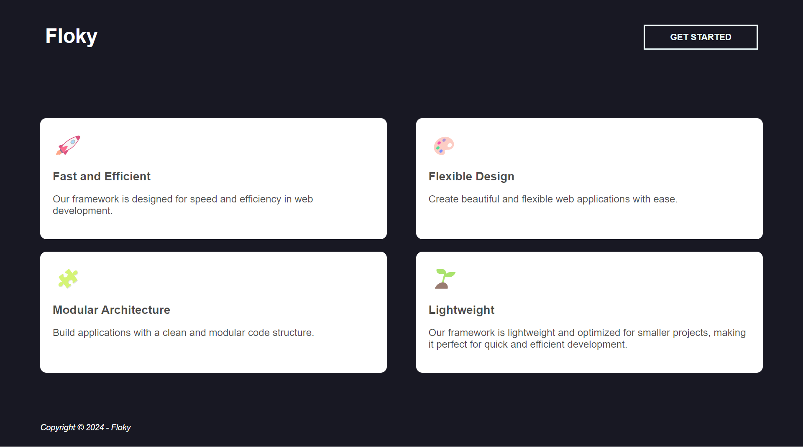

# Configuration

The configuration of your application is in the `.env` file (Rename the `.env.example` file to `.env`). Here you can define database settings, secret keys, and other configurations specific to your application.

## Project Structure

- `public/`: The entry point of your application, the files accessible from the browser.
- `src/`: The main directory of your source code.
     - `app/`: Contains the controllers, entities, models, middleware, services, and other components of your application.
     - `config/`: Contains the configuration files of your application.
     - `database/`: Contains migration files, seeders, ...
     - `routes/`: The route definition files for your application.
     - `storage/`: Files generated by the application, such as logs, sessions, etc.
     - `views/`: Contains the template files for generating views.
     - ... (other directories and files specific to your project)
- `test/`: Contains the test files for the application.

## How to Launch the Application

Once you have Floky installed, you are ready to launch your application. Follow these simple steps to start your project:

### Use PHP server

1. **Environment Configuration**: Before launching your application, make sure you have correctly configured the environment. Make sure settings, such as database connection and other options specific to your project, are set correctly.

2. **Database Migrations**: If your application uses a database, be sure to perform the necessary migrations to create the database tables and schemas. You can use specific commands provided by the framework to perform these migrations :

    ```bash	title="Prepare all migrations"
    php floky make:migrations
    ```

    ```bash	title="Run all migrations"
    php floky run:migrations
    ```

3. **Creating Routes**: Configure your routes in the `src/routes/` directory. This is where you specify how URLs should be handled by your application. You can define controllers, actions and parameters for each route.

4. **Creating Controllers and Views**: Develop controllers and views to manage different parts of your application. Controllers define the logic for handling requests, while views define the presentation of the data.

5. **Launching the Development Server**: Use the specific command to launch the integrated development server of your framework. This will allow you to test your application locally.

    ```bash
    php floky serve --port 8080
    ```
    
6. This command will launch the development server at http://localhost:8080, and you will be able to access your application from your browser.

7. You will see this welcome page :



### Use a Local Web Server

- Launching the Local Web Server: Start your local web server (for example, Apache or Nginx) and configure it to serve your application from the `public` directory of your project.

- Access to the Application: Open your web browser and navigate to the appropriate URL for your local web server. You will be able to see your application running.